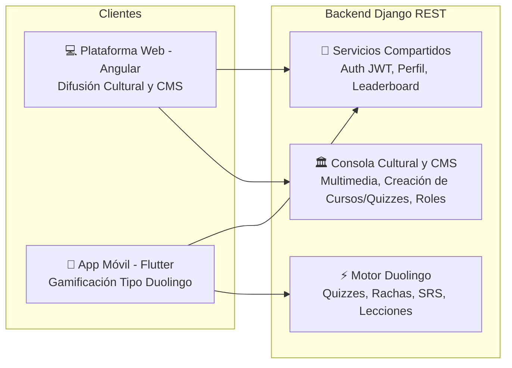

# Documento de Arquitectura y Modularización: Ecosistema Yonna Akademia

**Proyecto:** Sistema Integral para la Preservación y Revitalización del Wayuunaiki y las Tradiciones Wayuu
**Autor:** Iván Martínez
**Institución:** Universidad de La Guajira

---

## 1. Visión General del Ecosistema

Yonna Akademia es una solución tecnológica integral diseñada para revitalizar el idioma wayuunaiki y preservar el patrimonio cultural del pueblo Wayuu. Para lograr un alcance óptimo y mantener un enfoque claro en la experiencia del usuario, el ecosistema se divide en dos frentes que interactúan de manera simbiótica a través de un backend centralizado.

1. **Plataforma Web (Angular):** Actúa como el gran repositorio cultural y centro de difusión. Está orientada al consumo de contenido multimedia, documentación de tradiciones, gastronomía, mitos y arte, además de la gestión académica.
2. **Aplicación Móvil (Flutter):** Actúa como el motor de gamificación y práctica constante. Está estrictamente orientada al aprendizaje interactivo del wayuunaiki, empleando mecánicas de retención y repetición.

Ambas plataformas comparten la misma base de datos de usuarios, lo que permite una transición fluida. Un estudiante puede leer sobre un mito Wayuu en la plataforma web y, posteriormente, abrir la aplicación móvil para completar su lección diaria y mantener su racha activa.

---

## 2. Arquitectura de Datos y Backend (Django REST Framework + PostgreSQL)

El núcleo del sistema es una API REST unificada que sirve tanto al frontend web como al móvil. Esto garantiza que el estado del usuario (puntos, rachas, niveles) sea consistente sin importar desde dónde acceda.

### 2.1. Gestión de Identidad y Sesión compartida
*   **Autenticación:** Sistema basado en JSON Web Tokens (JWT). Un usuario utiliza las mismas credenciales para la Web y la App.
*   **Deep Linking (Navegación Cruzada):** El backend proporciona enlaces dinámicos. Desde el perfil del usuario en la plataforma web, existe un botón o código QR que redirige directamente a la aplicación móvil (si está instalada) o a las tiendas de aplicaciones. De igual forma, la app contiene enlaces que abren artículos culturales específicos en la plataforma web.

### 2.2. Modelo de Gamificación Centralizado
*   **Rachas (Streaks):** Contador de días consecutivos de actividad. Se actualiza principalmente mediante la App, pero es visible como una medalla de honor en el perfil de la plataforma Web.
*   **Puntos de Experiencia (XP) y Niveles:** Se acumulan al completar lecciones en la App o al consumir módulos de aprendizaje en la Web.
*   **Leaderboard (Podio):** Calculado en el servidor mediante Redis para garantizar tiempos de respuesta rápidos en ambas plataformas.

---

## 3. Módulo 1: Plataforma Web (Difusión y Gestión Cultural)

La plataforma web es el portal principal para la preservación cultural. Su diseño permite diferentes niveles de profundidad dependiendo del estado del usuario.

### 3.1. Flujo para Usuarios No Registrados (Invitados)
*   **Landing Page y Exploración Básica:** Tienen acceso a una vista general de la cultura Wayuu.
*   **Contenido Público:** Pueden visualizar videos cortos, artículos introductorios, galerías de imágenes sutiles y material de divulgación general.
*   **Limitación:** No pueden acceder a cursos formales, no acumulan XP, no tienen perfil y no pueden ver contenido exclusivo o avanzado. El objetivo es captar su interés para que se registren.

### 3.2. Flujo para Usuarios Registrados (Estudiantes)
*   **Perfil Completo:** Visualización de sus estadísticas (XP, Nivel, Racha actual) obtenidas tanto en la Web como en la App.
*   **Aprendizaje y Cultura:** Acceso a módulos teóricos y contenido multimedia profundo.
*   **Redirección a la App:** Botones de llamado a la acción continuos (ej. "Continúa tu práctica de vocabulario en la App para no perder tu racha").

### 3.3. Flujo para Roles Específicos (Creadores de Contenido / Moderadores)
*   **Panel de Administración de Contenidos:** Interfaz especializada para subir y catalogar patrimonio cultural.
*   **Tipos de Contenido Exclusivo:** Tienen permisos para publicar videos de danzas (Yonna), recetas de gastronomía tradicional, galerías de arte, telares y transcripciones de mitos y leyendas.
*   **Gestión Educativa:** Pueden estructurar los cursos, agregar vocabulario al diccionario y definir los metadatos de las lecciones.

---

## 4. Módulo 2: Aplicación Móvil (Gamificación y Aprendizaje Activo)

La aplicación móvil es una herramienta de uso diario, enfocada estrictamente en el aprendizaje del idioma wayuunaiki mediante mecánicas de juego. No está diseñada para leer textos largos sobre cultura, sino para la práctica ágil.

### 4.1. Funcionalidades Core de la App
*   **Ruta de Aprendizaje Progresiva:** Árbol de lecciones secuenciales. Cada nodo es un reto de vocabulario, gramática o pronunciación.
*   **Mecánicas de Retención (Bucle Gamificado):**
    *   **Vidas / Energía:** Límite de errores permitidos por sesión.
    *   **Racha Diaria:** Notificaciones push para recordar al usuario que debe practicar para no perder su racha.
    *   **Recompensas Inmediatas:** Animaciones y sonidos al responder correctamente, otorgamiento de XP en tiempo real.
*   **Repaso Espaciado (SRS):** Tarjetas interactiva (Flashcards) para memorizar palabras en wayuunaiki, priorizando los términos donde el usuario comete más errores.
*   **Sincronización Bidireccional:** Al finalizar una lección, la app envía una petición (POST) al backend para sumar XP. Inmediatamente, si el usuario abre la plataforma Web, su nivel y XP estarán actualizados.

---

## 5. Estructura de Roles y Permisos del Sistema

Para contextualizar a los agentes de IA en el desarrollo del sistema, la base de datos debe manejar los siguientes roles jerárquicos:

| Rol de Usuario | Permisos en Plataforma Web | Permisos en Aplicación Móvil |
| :--- | :--- | :--- |
| **Visitante** (No Autenticado) | Exploración de contenido básico (videos generales, artículos públicos). Cero acceso a cursos. | N/A (Debe registrarse/iniciar sesión para usar la app). |
| **Estudiante** (Registrado) | Acceso a cursos teóricos, diccionario, visualización de progreso y lectura de artículos culturales avanzados. | Acceso completo a la ruta de aprendizaje, quizzes, leaderboards y sistema de rachas. |
| **Creador de Contenido** | Todo lo del Estudiante + Acceso al panel CMS para publicar multimedia (danzas, mitos, arte, gastronomía). | Igual que el Estudiante. |
| **Administrador** | Control total. Gestión de usuarios, moderación de contenido, métricas del sistema y roles. | Igual que el Estudiante + Acceso a herramientas de depuración si aplica. |

---

## 6. Integración para el Desarrollo (Instrucciones para Agentes de IA)

Para los asistentes de IA que colaboran en la programación del código, el proyecto debe estructurarse con la siguiente separación de responsabilidades:

1.  **Backend (Repositorio Principal):**
    *   Debe exponer endpoints agnósticos a la plataforma (`/api/v1/users/`, `/api/v1/gamification/`, `/api/v1/culture/`).
    *   El modelo `UserModel` debe contener los campos `xp`, `current_streak`, `longest_streak` y `role`.
    *   Implementar protección de rutas: Los endpoints bajo `/api/v1/culture/upload/` solo deben aceptar peticiones si el JWT corresponde a un usuario con rol de Creador o Administrador.
2.  **Frontend Web (Angular):**
    *   Enfocarse en un diseño responsivo, fuertemente visual para la presentación de galerías (arte, gastronomía, danzas).
    *   Crear Guards (`AuthGuard`, `RoleGuard`) para proteger las rutas de creación de contenido.
3.  **Frontend Móvil (Flutter):**
    *   Enfocarse en la fluidez de las animaciones y tiempos de respuesta rápidos.
    *   No incluir vistas complejas de creación de contenido; la app consume contenido, no lo administra.
    *   Implementar almacenamiento local (SharedPreferences/SecureStorage) para el token JWT y permitir reanudación de sesión rápida.

---

## 7. Mapeo Integral de Rutas y Distribución por Plataforma (Web vs. Móvil)

Para garantizar la coherencia arquitectónica entre el repositorio cultural (**Web Angular**) y el motor de gamificación y aprendizaje activo (**Móvil Flutter**), la API central de Django REST Framework se distribuye en tres categorías funcionales:

### 7.1. Endpoints Compartidos (Sincronización Bidireccional Web ↔ App)
Endpoints que ambas plataformas consumen para garantizar identidad única, estado de juego y persistencia de perfil:

| Módulo | Método | Endpoint | Propósito | Rol Mínimo |
| :--- | :---: | :--- | :--- | :---: |
| **Autenticación** | `POST` | `/api/auth/register/` | Registro de nuevos usuarios aprendices | Público |
| **Autenticación** | `POST` | `/api/auth/login/` | Inicio de sesión unificado (retorna JWT + XP + nivel) | Público |
| **Autenticación** | `POST` | `/api/auth/logout/` | Cierre de sesión e invalidación de tokens | Autenticado |
| **Autenticación** | `POST` | `/api/auth/google/` | Login federado vía Google OAuth2 | Público |
| **JWT** | `POST` | `/api/auth/token/refresh/` | Refresco transparente del token de acceso | Público |
| **Perfil** | `GET` | `/api/auth/me/` | Datos en tiempo real del jugador (XP, nivel, rol, racha) | Autenticado |
| **Perfil** | `GET/PATCH` | `/api/auth/profile/` | Consulta y actualización de datos personales y avatar | Autenticado |
| **Diccionario** | `GET` | `/api/vocabulary/categories/` | Listado general de categorías del diccionario | Público |
| **Diccionario** | `GET` | `/api/vocabulary/entries/` | Consulta de palabras con filtros y audio nativo | Público |
| **Gamificación** | `GET` | `/api/gamification/leaderboard/` | Podio global de jugadores (Top 50 en Redis) | Autenticado |
| **Gamificación** | `GET` | `/api/gamification/my-badges/` | Insignias y logros obtenidos por hitos | Autenticado |
| **Progreso** | `GET` | `/api/progress/global/` | Resumen de métricas globales de aprendizaje | Autenticado |
| **Notificaciones**| `GET` | `/api/notifications/unread-count/`| Conteo de notificaciones no leídas | Autenticado |

---

### 7.2. Endpoints Primarios para la Aplicación Móvil (Motor Duolingo - Flutter)
La app móvil consume las rutas diseñadas para el bucle de retención, práctica ágil de Wayuunaiki, racha diaria y repetición espaciada. Como define el apartado 6.3, **la app móvil no incluye endpoints de autoría ni administración**:

| Función Móvil (Duolingo) | Método | Endpoint | Payload / Parámetros | Comportamiento en la App Móvil |
| :--- | :---: | :--- | :--- | :--- |
| **Racha Diaria (Fuego 🔥)** | `GET` | `/api/gamification/my-streak/` | Ninguno | Alimenta el indicador de racha superior, días consecutivos y tokens de congelamiento (`freeze_tokens`). |
| **Árbol de Aprendizaje** | `GET` | `/api/courses/available/` | Ninguno | Construye el mapa de nodos/lecciones. Solo muestra cursos desbloqueados (`level_required <= user.level`). |
| **Inscripción a Curso** | `POST` | `/api/courses/enroll/` | `{"course_id": int}` | Desbloquea un curso para el aprendiz al iniciar una unidad temática. |
| **Cursos en Curso** | `GET` | `/api/courses/my-enrollments/` | Ninguno | Carga los porcentajes de avance de cada nodo del árbol de aprendizaje. |
| **Retos / Quizzes Activos** | `GET` | `/api/quizzes/available/` | Ninguno | Listado de quizzes evaluativos con recompensas de XP y límite de tiempo. |
| **Lección Interactiva** | `GET` | `/api/quizzes/<id>/` | ID en URL | Descarga las preguntas interactivas (opción múltiple, completar, traducción). |
| **Envío de Lección (Core)**| `POST` | `/api/quizzes/submit/` | `{"quiz_id": int, "answers": {...}, "time_taken": int}` | **Punto neurálgico**: evalúa respuestas, calcula precisión, otorga XP, actualiza la racha y activa animaciones de éxito. |
| **Historial de Intentos** | `GET` | `/api/quizzes/my-attempts/` | Ninguno | Consulta de lecciones aprobadas/reprobadas y puntajes logrados. |
| **Palabra del Día** | `GET` | `/api/vocabulary/entries/word-of-the-day/` | Ninguno | Tarjeta destacada en el Home para incentivar la práctica rápida de vocabulario. |
| **Flashcards / SRS** | `GET` | `/api/vocabulary/entries/<id>/my-progress/` | ID en URL | Consulta del nivel de dominio de cada término (0=Vista, 1=Aprendiendo, 2=Familiar, 3=Dominada). |
| **Sesión de Repaso** | `PATCH`| `/api/vocabulary/entries/<id>/my-progress/` | `{"mastery_level": int}` | Registra la práctica de memoria espaciada con tarjetas interactivas. |
| **Avisos de Racha** | `GET` | `/api/notifications/recent/` | Ninguno | Notificaciones push e in-app (*"¡Mantén viva tu racha hoy en Wayuunaiki!"*). |

---

### 7.3. Endpoints Primarios para la Plataforma Web (Repositorio Cultural & CMS - Angular)
La plataforma web concentra la documentación cultural extensa (galerías, relatos, recetas, danzas), el consumo de módulos teóricos y el panel de gestión para **Creadores de Contenido** y **Administradores**:

| Módulo Web | Método | Endpoint | Rol Requerido | Función en la Plataforma Web |
| :--- | :---: | :--- | :---: | :--- |
| **Galería Multimedia** | `GET` | `/api/media/media/` | Visitante / Estudiante | Catálogo audiovisual público de danzas Yonna, gastronomía y música Wayuu. |
| **Colecciones Culturales**| `GET` | `/api/media/collections/` | Visitante / Estudiante | Series temáticas y álbumes multimedia de patrimonio cultural. |
| **Publicación CMS** | `POST` | `/api/media/media/` | Creador / Admin | Formulario de carga de videos, audios, fotos y documentos con metadatos. |
| **Gestión de Medios** | `PUT/DELETE`| `/api/media/media/<id>/` | Creador / Admin | Edición o retiro de contenido cultural (`IsOwnerOrAdmin`). |
| **Aprobación de Contenido**| `POST` | `/api/media/media/<id>/approve/` | Creador / Admin | Módulo de moderación para publicaciones enviadas por la comunidad. |
| **Creación de Cursos** | `POST` | `/api/courses/create/` | Creador / Admin | Diseñador curricular: creación de módulos y cursos con nivel requerido. |
| **Edición de Cursos** | `PUT/PATCH`| `/api/courses/<id>/update/` | Creador / Admin | Actualización de contenido teórico de cursos (`IsOwnerOrAdmin`). |
| **Eliminación de Cursos**| `DELETE` | `/api/courses/<id>/delete/` | Creador / Admin | Retiro controlado de cursos (`IsOwnerOrAdmin`). |
| **Creación de Quizzes** | `POST` | `/api/quizzes/create/` | Creador / Admin | Generación de preguntas y opciones para las evaluaciones. |
| **Edición de Quizzes** | `PUT/PATCH`| `/api/quizzes/<id>/update/` | Creador / Admin | Actualización de parámetros de evaluación y preguntas (`IsOwnerOrAdmin`). |
| **Eliminación de Quizzes**| `DELETE` | `/api/quizzes/<id>/delete/` | Creador / Admin | Retiro de cuestionarios (`IsOwnerOrAdmin`). |
| **Gestión de Diccionario**| `POST/PUT/DELETE`| `/api/vocabulary/entries/` | Creador / Admin | Curaduría lingüística del diccionario bilingüe (adición de audios y transcripciones). |
| **Categorías Léxicas** | `POST/PUT/DELETE`| `/api/vocabulary/categories/` | Creador / Admin | Creación y ordenamiento de categorías del vocabulario. |
| **Padrón de Usuarios** | `GET` | `/api/auth/users/` | Admin / Moderador | Vista de aprendices registrados, estado de cuenta y fechas de ingreso. |
| **Asignación de Roles** | `PATCH` | `/api/auth/users/<id>/role/` | Admin | Panel de administración de permisos (promoción a Creador o Admin). |
| **Métricas Globales** | `GET` | `/api/stats/admin/` | Admin / Moderador | Dashboard analítico de retención, horas de estudio y actividad semanal. |
| **Estadísticas de Curso** | `GET` | `/api/courses/statistics/` | Admin / Moderador | Análisis de cursos más populares y tasas de finalización. |